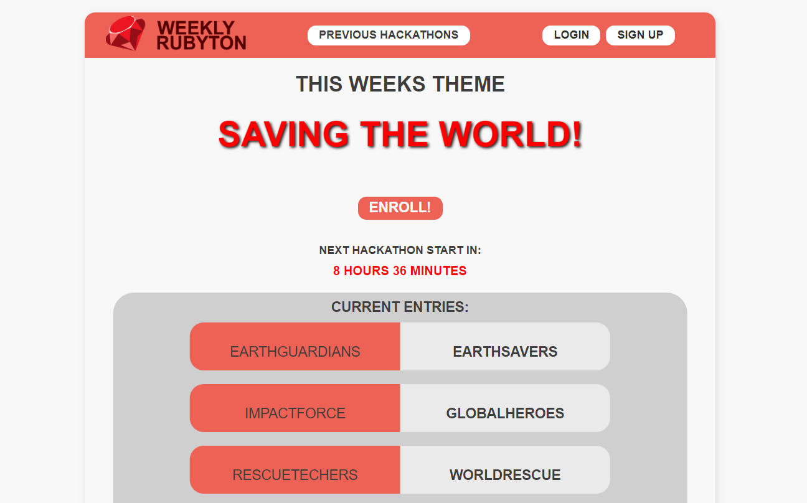

# Rubyton

The Rubyton application was created during the online Rails Hackathon July 28th - July 30th 2023,
where the theme was "Supporting the Ruby on Rails Community".

This is a simple application representing weekly ruby hackathons.
The user once a week can enroll to the ruby hackathon.
We chose this topic to bring the ruby community together.

It is hosted on Railway - https://team-135-production.up.railway.app/

Enrollment for the hackathon is available upon registration.
The user is able to see previous hackathons and its entries, as well as present entries.

## Features

- **Authentication** (devise gem),
- **Weekly Change of Hackathon Theme** (whenever and chronic gems)
- **Basic CRUD operations** (scaffold for Entry model),
- **Configured PostgreSQL Database on Railway**.
